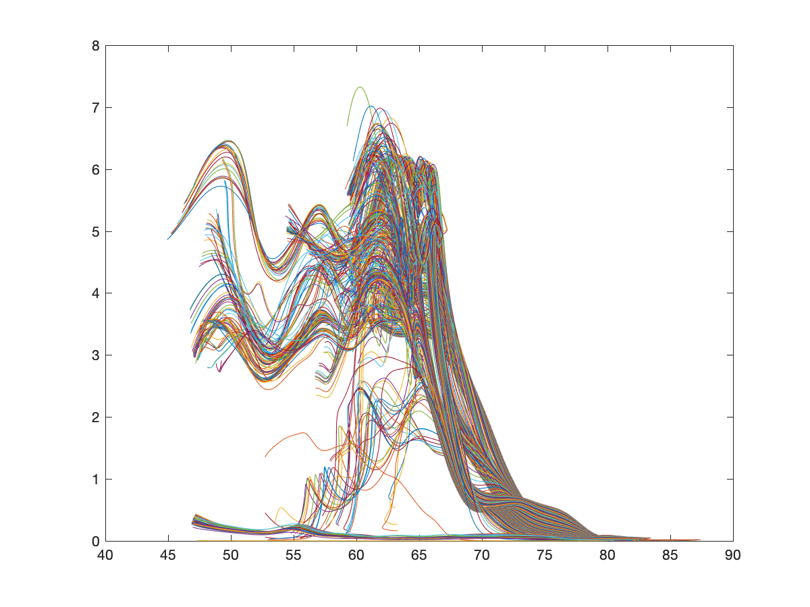
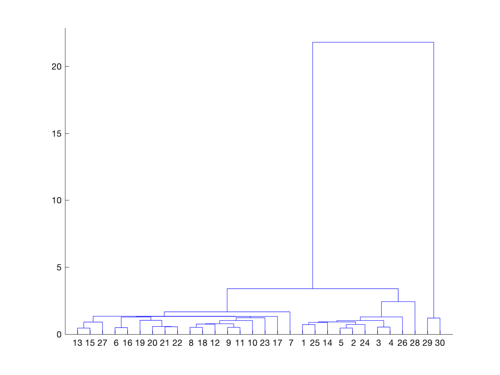
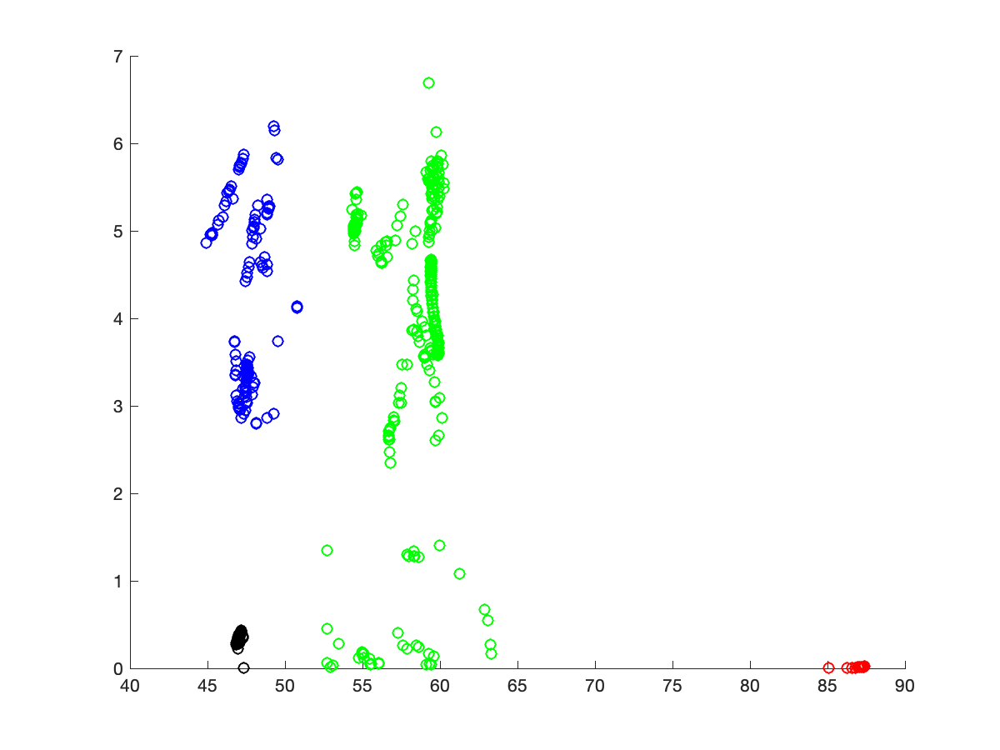
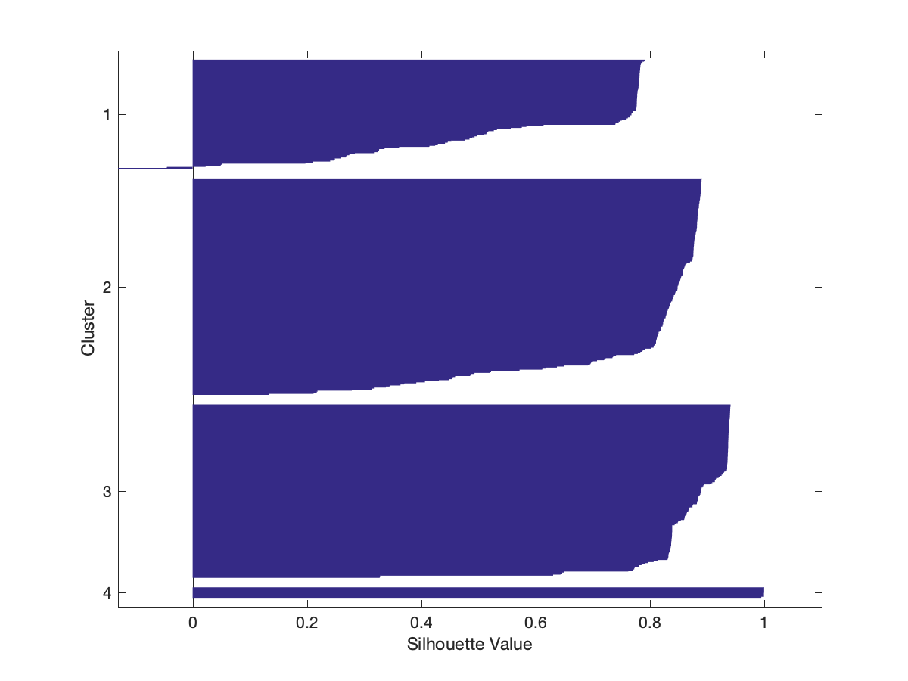
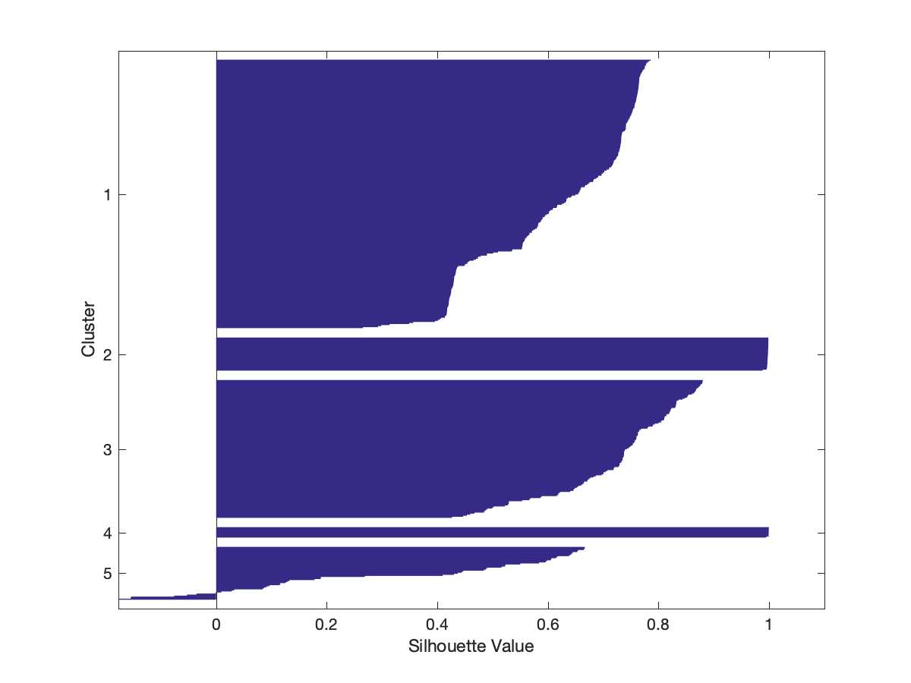
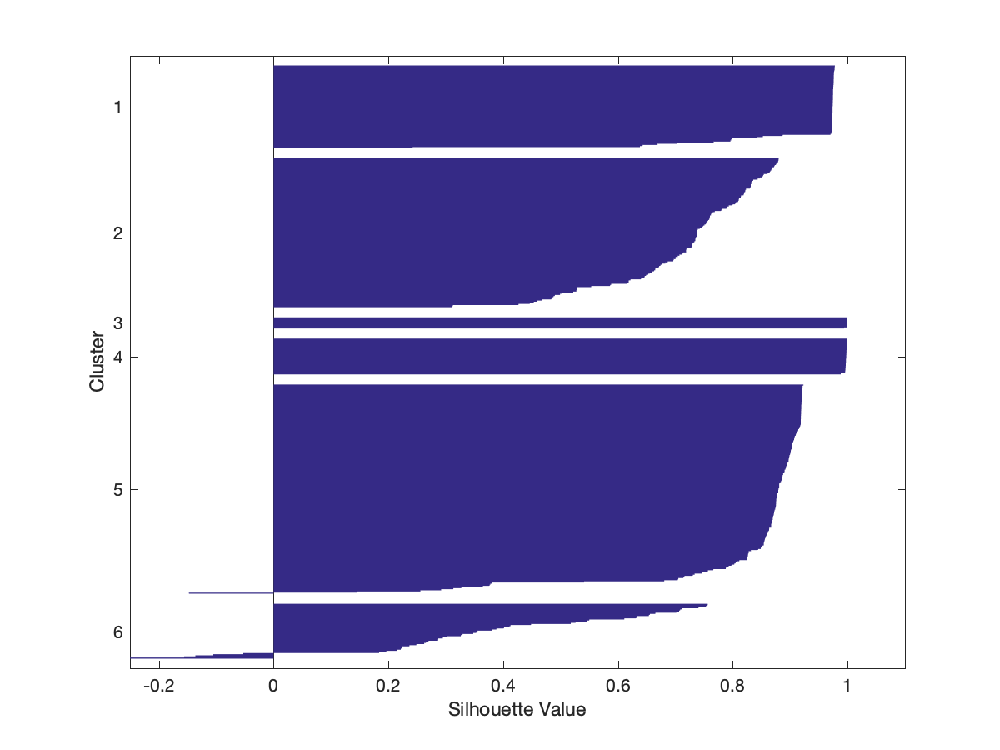
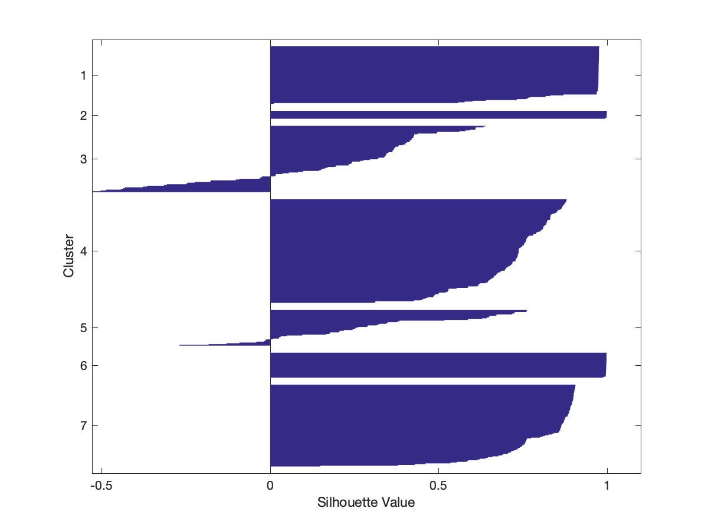
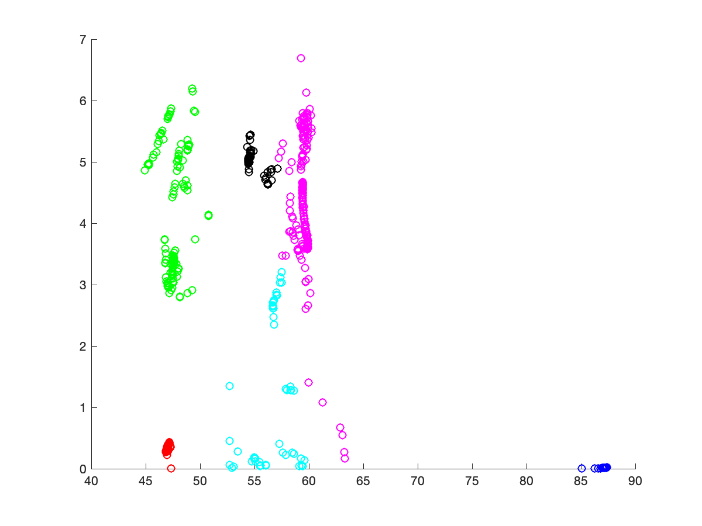

# Squall Line Trajectories

This is based off of some work I was doing with Patrick Skinner at the
National Severe Storms Laboratory.  He read a paper with the idea of
applying clustering methods to objectiely analyzing trajectories through
meteorological systems.  A common problem in studying systems is learning
how the air flows through them.  In severe storms, this often translates
to discovering where the outflow originates.

For the purpose of this project, I simulated a simple squall line
using CM1 (for those interested in the technical details, it's a
Weisman-Klemp sounding with an RKW wind profile and Morrison microphysics).
To compute the trajectories, I used my [cm1_pp_v1.0](http://www.github.com/RyanHastings/cm1_pp).

I then identified the origins.

This becomes a problem of identifying clusters in Euclidean space.  I
first followed the literature and tried hierarchical clustering.  The
dendrogram is below.

Eyeballing it, the level at which four clusters seems to be the
best for consistency vs similarity.  That gives us four clusters as
seen below.

I then decided to try *k*-means clustering.  I arbitrarily chose
to run with clusters 4-7, based on four seeming to be an optimum
number in the hierarchical clustering.  Silhouette plots below.

with a mean of 0.7837

with a mean of 0.6487

with a mean of 0.7890 and

with a mean of 0.6609.

With the highest mean, I selected six vectors for the *k*-means
clustering, which yielded the following:

Code in Matlab available at [traj_clustering.m](traj_clustering.m) using
data from [parcels.nc](parcels.nc) which is in netCDF format.  If you're
downloading this, be sure to grab [newfig.m](newfig.m) as well to run it
on your own.
